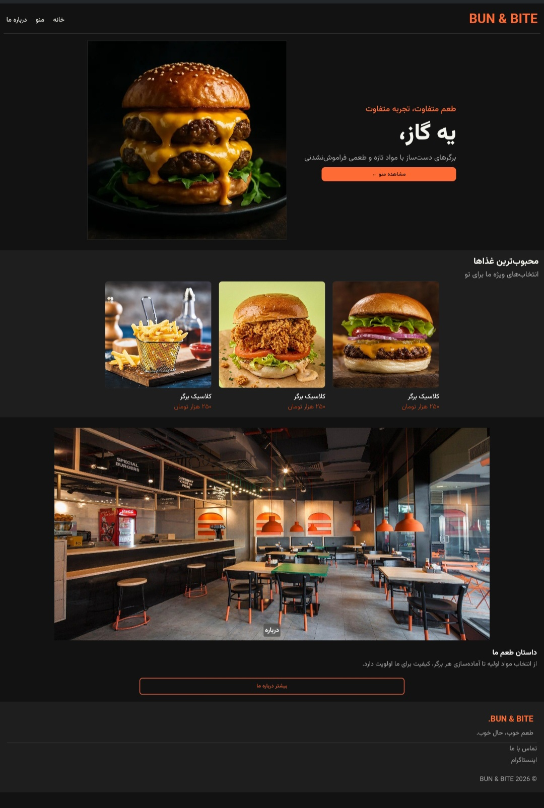

# 🍔 BUN & BITE

A modern and minimal restaurant website built with HTML and CSS.

## ✨ Features

* Modern dark design
* Food menu cards
* Hero section with food photography
* Restaurant information section
* Clean and organized code

## 🛠️ Built With

* HTML5
* CSS3
* Flexbox
* 
## 🎨 Color Palette

| Color              | Hex       |
| ------------------ | --------- |
| Background         | `#121212` |
| Section Background | `#1A1A1A` |
| Card Background    | `#1E1E1E` |
| Accent             | `#FF6B35` |
| Main Text          | `#F5F5F0` |
| Secondary Text     | `#A3A3A3` |

## 🚀 Getting Started

1. Clone or download this repository.
2. Open `index.html` in your browser.
3. Explore the website.

## 📌 Note

This project is a front-end practice project. It uses HTML and CSS only; interactive ordering features are not implemented.

## 📄 License

This project is for educational and portfolio purposes.
